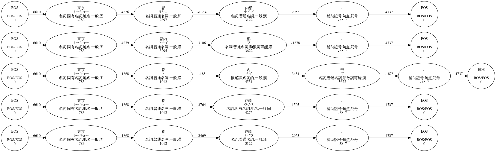

# mecab-visualizer

[](https://colab.research.google.com/drive/1NeBRUO6QjQlT1vlwWEojCgI0U4pLwBHi?usp=drive_link)

## Introduction

MeCabの形態素解析結果を可視化するツール

## Dependencies

- MeCab
- fugashi
- graphviz

## Usage

```python
from visualizer import MecabVisualizer

mecab_visualizer = MecabVisualizer()

text = "東京都内部。"

graph = mecab_visualizer.draw_graph_nbest(text, num=5)
```




